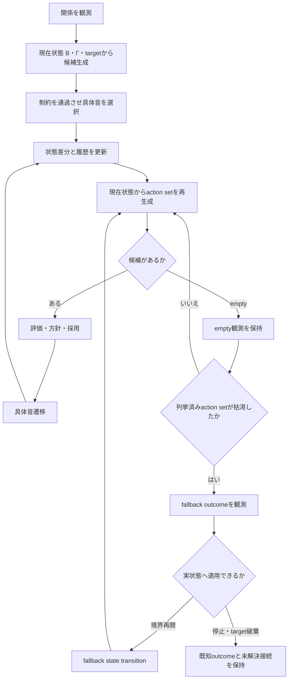

# 検証記録：音程分解・10〜22の動態圧縮

*対象：10〜22で確認した音程分解Moduleの候補生成・再探索・fallback動態の圧縮*
*状態：DRAFT v0.1 / 音程分解Module候補*
*参照：`10_検証/10_音程分解_周波数比から12TET半音数_最小実験.md`〜`22_音程分解_fallback採用後の実状態遷移_最小実験.md`*

---

## ■ 0. 目的と範囲

10〜22では、音程を単一のラベルや一回限りの候補判定として扱わず、関係の抽出から具体音の実現、空集合後の再探索、fallback後の通常探索復帰までを段階的に接続した。

23は新しい操作や音楽一般の法則を追加しない。各検証の境界を保ったまま、次の二つを一枚に圧縮する。

```text
10〜17：候補が生まれ、比較され、採用されるまで
18〜22：採用後の状態が、履歴を持って次の探索へ戻るまで
```

`B`・`Γ`・target・声域・controllerは、音程分解Moduleへ注入した検証用の具体化である。Coreの状態変数や音楽一般の規則へ昇格させない。

---

## ■ 1. 全体構造



ここで候補生成へ直接入るのは、現在状態にある`B`・`Γ`・targetである。`M_B`やlearned/context側の構造は、targetや探索方針の上流条件になりうるが、検証用の候補生成器とCoreの`M_B`を同一視しない。

同じ「変化」に見えるものを、次の三層へ分ける。

```text
actionを評価・観測した履歴                          observation_history
fallbackを採用し、具体音を実現せず構造状態だけ変更した履歴 fallback_transition_history
ordinary actionを採用し、具体音状態まで実現した履歴     realized_transition_history
```

---

## ■ 2. 10〜17：候補生成から採用条件まで

| 検証 | 追加された構造 | 確定した境界 |
|---|---|---|
| 10 | 周波数比・セント・12TET座標／カテゴリー | 物理比と記述カテゴリーを同一視しない |
| 11〜12 | 綴り・音程カテゴリー・代表的motion | 同一音高・同一半音数でも関係構造で分岐しうる |
| 13 | 文脈・音度役割・learned tendency・target注釈 | target候補と具体音への移動を分離する。12ではtargetは外部入力として扱う |
| 14 | 実現境界・綴り・範囲・順序・選択 | 音度から具体音へ落とす規則を明示する |
| 15 | 候補生成・制約・選択・失敗段階 | `empty`を失敗一般やB引き直しへ直ちに変換しない |
| 16 | `B_change`・`Γ_change`・`upstream_target_change` | 空集合後の分岐を一つへ潰さない |
| 17 | 保存条件・比較順・実音高移動量 | 候補があっても採用は一意に決まらない |

```text
physical relation
  ↓
12TET coordinate / category
  ↓
learned description
  ├─ spelling
  ├─ interval category
  └─ representative motion
  ↓
contextual role
  ├─ 文脈
  ├─ 音度役割
  ├─ learned tendency
  └─ target annotation
  ↓
B / Γ / targetから候補生成
  ↓ Γ_spelling・B_realization
具体音候補
  ↓ B_range_projection・Γ_ordering
許容候補対
  ↓ Γ_select・SearchPolicy
採用候補またはempty
```

`Γ`は候補生成・制約・比較のための規則であり、Coreの状態変数ではない。learned/context側の構造はtargetや方針の上流条件になりうるが、候補生成へ直接入る現在状態の`B`・`Γ`・targetとは層を分ける。`M_B候補`も、特定の`B`と`Γ`のもとで回収された検証上の候補であり、`M_B`そのものの再定義ではない。

---

## ■ 3. 18〜19：候補から状態動態へ

18では、採用枝を次状態へ反映し、履歴から次の方針を選ぶ接続を作った。ただし候補枝は固定メニューだった。19では、枝を結果テンプレートではなく、現在状態へ適用する操作候補へ置き換えた。

```text
DynamicSearchState
├─ B相当：voice_A / voice_Bの実現境界
├─ Γ相当：pitch_ordering_rule
├─ target：voiceごとのtarget degree
├─ last_realized_pair
├─ last_change_axes
├─ observation_history
├─ fallback_transition_history
└─ realized_transition_history
```

`last_realized_pair`は現在の`B`で有効なペアではない。最後に具体音として実現したペアを、次回の具体音選択に使う移動基準として保持する。

```text
state_t
  ↓ actionを適用
B / Γ / target を変更
  ↓
state_t+1の条件から候補を再生成
  ↓
適用前後の状態差分から実際のchange_axesを計算
  ↓
候補があれば評価・採用
  ↓
last_realized_pairとrealized_transition_historyを更新
```

操作名から変更軸を逆算しない。`boundary_changed`・`relation_changed`・`upstream_target_changed`は状態差分から計算する。既適用操作は`no_effect`として観測し、同じ変更を二重記録しない。

---

## ■ 4. 20〜22：empty・枯渇・fallback

### 4.1 empty

```text
operation_status = applied
candidate_status = constraint_no_candidate
evaluation = None
selected = None
```

```text
操作した
  ≠ 候補が生まれた
  ≠ 比較可能である
  ≠ 採用された
```

empty操作は具体音遷移として採用せず、`observation_history`へ記録する。Bやtargetが変化しても、具体音の採用がなければ`realized_transition_history`は増えない。

### 4.2 列挙済みaction setの枯渇

21で確認したのは、可能な操作全体の消滅ではない。

```text
current stateから列挙した action set
  = B_change / Γ_change / upstream_target_change
  ↓ 同じsource stateから独立に評価
三枝すべてがempty
  ↓
action_set_exhausted
```

三枝を逐次適用した結果ではなく、同じsource stateからの一手先分岐を比較している。この限定を外して「全操作が失敗した」とは言わない。

### 4.3 fallbackの二段階

| fallback | 21での位置づけ | 22での扱い |
|---|---|---|
| `stop_search` | outcome observation | 実状態化後の上位controller接続がξ |
| `reopen_voice_B_boundary` | outcome observation | 実状態遷移へ採用 |
| `discard_target` | outcome observation | targetなし状態の表現と次target生成がξ |

22では境界再開だけを実際に適用した。

```text
S2_action_set_exhausted
  ↓ reopen_voice_B_boundary
S3_boundary_reopened
  ├─ fallback_transition_history +1
  └─ realized_transition_history +0
       ↓ S3から通常action setを再生成
S4_realized
  ├─ upstream_target_change
  ├─ fallback_transition_history = 1
  └─ realized_transition_history +1
       ↓ 通常探索を継続
S5_realized
  ├─ B_change
  └─ realized_transition_history +2
```

境界再開は具体音の実現ではない。候補空間を変えた構造遷移であり、具体音の採用は、その後に別の履歴として記録される。

---

## ■ 5. 履歴を含む最小循環

```text
S_t
  ↓ current action setを列挙
各枝を同一source stateから独立評価
  ├─ 候補あり
  │    ↓ evaluation → policy → selected action
  │  concrete realization
  │    ↓
  │  S_t+1 → realized_transition_history
  │
  └─ 候補なし
       ↓ empty diagnosis → observation_history
       ↓ 再探索
       ├─ 一部に候補あり → evaluation → policy → realization
       └─ 全枝empty
            ↓ action_set_exhausted
          fallback outcome observation
            ├─ stop_search
            │    └─ outcomeは既知／実状態化後の上位controller接続がξ
            ├─ reopen_voice_B_boundary
            │    ↓ 実状態へ適用
            │  fallback_transition_history
            │    ↓ 新しいstateから通常探索
            └─ discard_target
                 └─ outcomeは既知／targetなし状態の表現と次target生成がξ
```

```text
候補を見た
  ≠ 構造状態を変更した
  ≠ 具体音を実現した
```

---

## ■ 6. 10〜22で閉じたもの

```text
関係観測
  ↓ 境界依存の候補生成
  ↓ 実現制約による候補の消滅・通過
  ↓ 空集合後の複数再探索枝
  ↓ 保存条件と比較順による採用
  ↓ 状態差分からの履歴更新
  ↓ empty観測の保持
  ↓ 列挙済みaction set枯渇の診断
  ↓ fallback outcomeの分岐
  ↓ 境界再開fallbackの実状態化
  ↓ 通常探索への復帰
```

22で閉じたのは、境界再開という一つのfallbackを実状態へ適用し、通常探索へ戻す接続である。controllerが常に適切なfallbackを選ぶことや、探索が必ず終端することまでは意味しない。

---

## ■ 7. まだ閉じていないξ

```text
列挙済みaction set枯渇後のfallback選択controller
stop_search後に戻る上位controllerやB_context
discard_target後のtarget状態表現と代替target生成
fallbackの優先順位・権限・上限
複数fallbackを採用した場合の履歴と状態の接続
action set自体をいつ再定義するか
履歴の保持範囲・忘却・重み付け
controller自体の更新条件
```

```text
fallbackを実状態へ適用できた
  ≠ fallback選択規則が確定した
```

23は22までの実測を圧縮する文書であり、未定義の選択規則を新たに埋めない。

---

## ■ 8. Coreとの境界

23が追加するのは、10〜22の検証結果を読み取るための圧縮記述だけである。

```text
Core
  S_t → Δ → S_t+1
  B / M_B / W / F / E / H / ξ

音程分解Module・検証
  B_realization
  Γ_spelling / Γ_ordering / Γ_select
  target degree / voice range
  SearchPolicy
  observation_history
  fallback_transition_history
  realized_transition_history
```

声域、音度、fallbackの種類、controllerの写像はModuleの範囲に留める。23を根拠にCoreを拡張しない。

---

## ■ 9. 検証状態

23は実験器を追加しない圧縮文書である。次の意味分離が保たれていることを確認する。

```text
observation_history
  = 操作・empty・枯渇枝を観測した履歴

fallback_transition_history
  = fallbackを実状態へ適用した構造遷移の履歴

realized_transition_history
  = 具体音を採用して実現した状態遷移の履歴
```

この三層を一つの「遷移履歴」へ圧縮しないことが、23の圧縮条件である。
